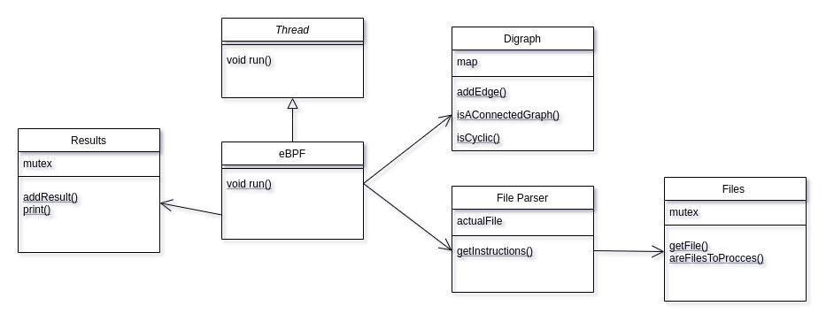
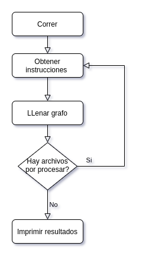

### Nombre : López Núñez, Agustín 
### Padrón: 101826 
### Repositorio : https://github.com/agustinlopezn/tp2-taller-de-programacion
 
<h1>

Taller de Programacion I [75.42] - TP2: Verificador de programas eBPF simplificado

</h1>

# Clases

## eBPF
Es la clase encargada de la ejecución de los threads. Hereda de *Thread* e implementa la función `run()` a la cual le realiza un *override*.  
Dentro de ella se utiliza tanto al grafo como al *file parser* para la realización de la consigna. Sirve de mediador entre ambas clases ya que otra implementación violaria el encapsulamiento o no tendrían sentido del punto de vista de POO (por ejemplo que el grafo sea un atributo del *file parser*).
## Digraph
Se implementó un grafo dirigido y sin pesos en las aristas, ya que, a fin de la problemática era la implementación mas sencilla y funcional a lo pedido. Se decidió implementar de la forma lista de adyacencias utilizando un `map` donde la clave sea el `string` que identifica al nodo (para el uso particular sería la línea) y el valor es una lista de strings con los nodos a los cuales se conecta. 
Como métodos a destacar se pueden comentar `isAConnectedGraph()` y `isCyclic()` que usan la implementación recursiva de [DFS](https://es.wikipedia.org/wiki/B%C3%BAsqueda_en_profundidad) (*Depth-first search*) y sirven para analizar si el grafo es conexo y si posee ciclos respectivamente
## File parser
Es el encargado de parsear las lineas de código y llevarlas a un formato que sea adecuado para introducir la información al grafo. Para no recurrir a leer un archivo 2 veces se usaron multiples estructuras que brinda el lenguaje para el almacenamiento de datos críticos. Para mantener una referencia al archivo que se está parseando se le pide a Files cual es ese archivo y se lo mantiene en la estructura del parser. 
La implementación lee linea a linea guardando los *labels*, instrucciones y sus respectivos números de líneas, luego se itera las estructuras (actuando como un compilador de doble pasada pero sin leer 2 veces el archivo, se podría ver como una tabla de símbolos), se hace el reemplazo de los labels por las lineas que representan y la lógica de los distintas instrucciones.
## Files
Es uno de los objetos requeridos por la consigna para funcionar de contenedor de archivos de los cuales los hilos van extrayendo, pudiendo crear una *race condition*. Para evitar esto se usan los *mutex* y su encapsulamiento RAII para *lockear* el objeto a un thread y que cuando se le pida un archivo no se actualicen referencias que podrían causar que distintos threads. 
## Results
Parecido a lo sucedido con Files esta clase usa un mutex para que al agregar resultados no se pisen entre hilos, afectando al output final.
## Lock
A modo de comentario es una clase wrapper que sirve para aislar un poco mas a la implementación del mutex y ademas es útil para secciones criticas en las que se tenga que devolver un valor (ya que al ser RAII, cuando se elimina el objeto se desbloquea el mutex, solucionando el problema de tener que crear variables extra u otras formas más complicadas).

# Flujo del programa 
